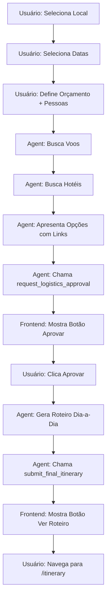

# Relatório de Implementação - AI Travel Agent Flow
**Data:** 28/11/2024  
**Sessão:** Fix Agent Approval Flow

---

## 📋 Sumário Executivo

Este documento detalha a implementação do fluxo de aprovação do agente AI para planejamento de viagens no Cash Trip, os problemas encontrados e as soluções propostas.

### Objetivo Principal
Implementar um fluxo sequencial onde:
1. ✅ Usuário define local, datas, orçamento e número de pessoas via modais
2. ⚠️ Agente busca e apresenta voos e hotéis
3. ❌ Agente solicita aprovação do usuário (via tool e botão)
4. ❌ Após aprovação, agente gera roteiro detalhado
5. ❌ Botão aparece para direcionar à página de itinerário

### Status Atual
- **Coleta de Dados:** ✅ Funcional
- **Busca de Logística:** ✅ Funcional
- **Aprovação de Logística:** ❌ **NÃO FUNCIONAL**
- **Geração de Roteiro:** ❌ Bloqueado pela aprovação
- **Navegação para Itinerário:** ❌ Bloqueado

---

## 🎯 Fluxo Desejado



---

## 📁 Arquivos Modificados

### Backend
- **`src/app/api/chat/route.ts`** (419 linhas)
  - System prompt otimizado e imperativo
  - MAX_LOOPS aumentado de 12 para 20
  - Logs detalhados em cada iteração
  - Tools: `search_flights`, `search_hotels`, `search_places`, `request_logistics_approval`, `submit_final_itinerary`

### Frontend
- **`src/components/trips/new/NewTripChat.tsx`** (436 linhas)
  - Interface `Message` estendida com tipos `action-view-itinerary` e `action-approve-logistics`
  - ⚠️ **Handlers de detecção ainda não aplicados**
  - ⚠️ **Botões de aprovação ainda não renderizados**

---

## 🔧 Implementações Realizadas

### 1. System Prompt Imperativo
**Arquivo:** `src/app/api/chat/route.ts` (linhas 41-68)

```typescript
const systemPrompt = `Você é o Agente Cash Trip...

**FASE 1 - LOGÍSTICA (FAÇA AGORA):**
1. Busque voos: chame search_flights
2. Busque hotel: chame search_hotels  
3. Apresente AS DUAS opções ao usuário com links reais
4. **IMEDIATAMENTE** após mostrar voo E hotel, você DEVE chamar a tool request_logistics_approval

⚠️ REGRA OBRIGATÓRIA: Depois de apresentar voo e hotel, a PRÓXIMA AÇÃO deve ser chamar request_logistics_approval. 
NÃO apenas mencione aprovação, CHAME A TOOL.
...`
```

**Objetivo:** Forçar o agente a chamar a tool em vez de apenas mencionar aprovação em texto.

### 2. Logs Detalhados no Backend
**Arquivo:** `src/app/api/chat/route.ts` (linhas 77, 197, 207, 212)

```typescript
console.log(`[Agent Loop ${loopCount}/${MAX_LOOPS}] Starting iteration...`);
console.log(`[Agent Loop ${loopCount}] Stop reason: ${response.stop_reason}`);
console.log(`[Agent Loop ${loopCount}] Tools called: ${toolUses.map(t => t.name).join(', ')}`);
```

**Objetivo:** Monitorar comportamento do agente e identificar quando tools são chamadas.

### 3. Detecção de request_logistics_approval
**Arquivo:** `src/app/api/chat/route.ts` (linhas 353-361)

```typescript
if (toolUses.some(t => t.name === 'request_logistics_approval')) {
    console.log(`[Agent Loop ${loopCount}] Returning to frontend for logistics approval...`);
    return NextResponse.json({
        content: response.content,
        stop_reason: 'tool_use',
        tool_use: toolUses.find(t => t.name === 'request_logistics_approval')
    });
}
```

**Status:** ✅ Implementado no backend

### 4. Extensão da Interface Message
**Arquivo:** `src/components/trips/new/NewTripChat.tsx` (linha 16)

```typescript
type?: 'text' | 'action-location' | 'action-date' | 'action-budget' 
    | 'action-view-itinerary' | 'action-approve-logistics'
```

**Status:** ✅ Implementado

---

## ❌ Problemas Identificados

### Problema 1: Agent Não Chama a Tool
**Sintoma:** Agent apresenta voos e hotéis, menciona aprovação em texto, mas não chama `request_logistics_approval`.

**Evidência:**
- Usuário vê opções de voo e hotel
- Mensagem diz "preciso da sua aprovação"
- Nenhum botão aparece
- Console do navegador não mostra logs de tool detection

**Causa Root:**
- System prompt pode não ser suficientemente claro
- Agent pode estar atingindo limite de tokens/contexto
- Agent pode estar interpretando que já obteve aprovação implícita

**Impacto:** 🔴 **Crítico** - Bloqueia todo o fluxo subsequente

### Problema 2: Frontend Não Detecta Tool Calls
**Sintoma:** Quando usuário digita mensagem após ver voos/hotéis, nada acontece.

**Evidência:**
- Loading aparece por 1 segundo
- Nenhuma resposta é exibida
- Console não mostra logs `[Frontend]`

**Causa Root:**
- Handlers de detecção não estão implementados em `initiateAgentHandover` e `handleSendMessage`
- Frontend espera apenas respostas de texto simples
- Quando backend retorna `stop_reason: 'tool_use'`, frontend não sabe processar

**Impacto:** 🔴 **Crítico** - Usuário não consegue prosseguir

### Problema 3: Botões de Ação Ausentes
**Sintoma:** Mesmo se tool fosse chamada, botões não seriam renderizados.

**Causa Root:**
- Código JSX para renderizar botões não foi adicionado
- Função `handleApproveLogistics` não existe

**Impacto:** 🔴 **Crítico** - Sem botões, não há como aprovar

---

## 🔍 Análise Técnica

### Fluxo Atual (Problemático)

```
1. User: Fornece dados iniciais
2. Frontend: Chama /api/chat (initiateAgentHandover)
3. Backend: Agent busca voos ✅
4. Backend: Agent busca hotéis ✅
5. Backend: Agent retorna texto com opções ✅
6. Frontend: Exibe texto ✅
7. Agent: Deveria chamar request_logistics_approval ❌ NÃO CHAMA
8. Backend: Retorna end_turn em vez de tool_use ❌
9. Frontend: Não detecta tool_use ❌
10. Usuário: Tenta digitar mensagem manualmente
11. Frontend: Chama /api/chat (handleSendMessage)
12. Backend: Agent processa mas não chama tools
13. Backend: Retorna resposta de texto
14. Frontend: Não exibe nada (handler ausente) ❌
```

### Fluxo Correto (Desejado)

```
1. User: Fornece dados iniciais
2. Frontend: Chama /api/chat
3. Backend: Agent busca voos ✅
4. Backend: Agent busca hotéis ✅
5. Backend: Agent apresenta opções com texto ✅
6. Backend: Agent IMEDIATAMENTE chama request_logistics_approval ✅
7. Backend: Retorna {stop_reason: 'tool_use', tool_use: {...}}
8. Frontend: Detecta tool_use.name === 'request_logistics_approval'
9. Frontend: Extrai texto da resposta (com voos/hotéis)
10. Frontend: Adiciona texto ao chat
11. Frontend: Adiciona botão "Aprovar Logística"
12. Usuário: Clica botão
13. Frontend: Chama handleSendMessage("Aprovado")
14. Backend: Agent gera roteiro
15. Backend: Agent chama submit_final_itinerary
16. Frontend: Detecta tool, exibe botão "Ver Roteiro"
```

---

## 🛠️ Soluções Propostas

### Solução 1: Fortalecer System Prompt (✅ Implementada)
**Ação:** Tornar o prompt ainda mais imperativo e específico.

**Implementado:**
```typescript
⚠️ REGRA OBRIGATÓRIA: Depois de apresentar voo e hotel, 
a PRÓXIMA AÇÃO deve ser chamar request_logistics_approval. 
NÃO apenas mencione aprovação, CHAME A TOOL.
```

**Próximos Passos:**
- Monitorar logs do backend para confirmar que tool é chamada
- Se ainda não funcionar, adicionar exemplo de chamada no prompt

### Solução 2: Implementar Handlers Frontend (❌ Pendente)
**Ação:** Adicionar detecção de tools em `initiateAgentHandover` e `handleSendMessage`.

**Código Necessário em `handleSendMessage` (após linha 304):**

```typescript
const data = await response.json()
console.log("[Frontend] handleSendMessage data:", data);

if (data.stop_reason === 'tool_use' && data.tool_use?.name === 'request_logistics_approval') {
    const assistantMessage = data.content?.find((c: any) => c.type === 'text')?.text
    
    const newMsgs: Message[] = []
    if (assistantMessage) {
        newMsgs.push({
            id: Date.now().toString(),
            sender: 'aurora',
            text: assistantMessage,
            type: 'text'
        })
    }
    
    newMsgs.push({
        id: (Date.now() + 1).toString(),
        sender: 'aurora',
        text: '',
        type: 'action-approve-logistics'
    })
    
    setMessages(prev => [...prev, ...newMsgs])
    return
}
```

**Mesma lógica necessária em `initiateAgentHandover`** (após linha 224)

### Solução 3: Adicionar Botões JSX (❌ Pendente)
**Ação:** Renderizar botões quando tipo correto está presente.

**Código Necessário no JSX (após linha ~413):**

```typescript
{msg.sender === 'aurora' && msg.type === 'action-approve-logistics' && (
    <button
        onClick={handleApproveLogistics}
        className="w-fit px-6 py-3 bg-[#4CAF50] rounded-[20px] text-white font-inria-sans font-bold shadow-lg hover:bg-[#43A047] transition-all"
    >
        <span>✅ Aprovar Logística</span>
    </button>
)}

{msg.sender === 'aurora' && msg.type === 'action-view-itinerary' && (
    <button
        onClick={() => router.push('/itinerary')}
        className="w-full max-w-xs px-6 py-4 bg-[#FF5F38] rounded-[20px] text-white font-inria-sans font-bold"
    >
        <span>Ver Roteiro Completo</span>
        <svg>...</svg>
    </button>
)}
```

### Solução 4: Adicionar Handler de Aprovação (❌ Pendente)
**Ação:** Criar função que remove botão e envia mensagem de aprovação.

**Código Necessário (após linha ~254):**

```typescript
const handleApproveLogistics = async () => {
    setMessages(prev => prev.filter(m => m.type !== 'action-approve-logistics'))
    await handleSendMessage("Logística aprovada! Pode criar o roteiro detalhado.")
}
```

---

## 📊 Checklist de Implementação

### Backend ✅
- [x] System prompt otimizado
- [x] MAX_LOOPS aumentado para 20
- [x] Logs detalhados adicionados
- [x] Detecção de request_logistics_approval
- [x] Detecção de submit_final_itinerary
- [x] Tools corretamente definidas

### Frontend ❌
- [x] Interface Message estendida
- [ ] **Handler em initiateAgentHandover** ⚠️ CRÍTICO
- [ ] **Handler em handleSendMessage** ⚠️ CRÍTICO
- [ ] **Função handleApproveLogistics** ⚠️ CRÍTICO
- [ ] **Botão Aprovar Logística no JSX** ⚠️ CRÍTICO
- [ ] **Botão Ver Roteiro no JSX** ⚠️ CRÍTICO

---

## 🚀 Plano de Ação Imediato

### Etapa 1: Aplicar Correções Frontend (MANUAL)
**Prioridade:** 🔴 CRÍTICA

1. Abrir `src/components/trips/new/NewTripChat.tsx` no editor
2. Aplicar as 4 modificações conforme documento `manual_edits.md`
3. Salvar e aguardar hot reload do Next.js

**Tempo Estimado:** 10-15 minutos  
**Risco:** Médio (erros de sintaxe possíveis)

### Etapa 2: Testar Fluxo Completo
**Prioridade:** 🔴 CRÍTICA

1. Recarregar página `/trips/new`
2. Abrir Console (F12)
3. Preencher dados (local, datas, orçamento)
4. **Verificar logs:** `[Agent Loop X]` no terminal Next.js
5. **Verificar logs:** `[Frontend]` no console do navegador
6. Aguardar voos e hotéis
7. Verificar se botão "Aprovar Logística" aparece
8. Clicar no botão
9. Aguardar geração do roteiro
10. Verificar se botão "Ver Roteiro" aparece

### Etapa 3: Debug se Necessário
**Prioridade:** 🟡 ALTA

Se após Etapa 2 ainda não funcionar:

1. **Capturar logs completos** do terminal e console
2. **Verificar no terminal:** Se `request_logistics_approval` foi chamada
3. **Verificar no console:** Se frontend recebeu `stop_reason: 'tool_use'`
4. **Ajustar system prompt** se agent não chamar tool
5. **Ajustar handlers** se frontend não detectar

---

## 📝 Notas Técnicas

### Limitações Conhecidas
- Google Places API usando versão legada (avisos no console são normais)
- Amadeus API pode ter rate limits
- Claude 4.5 Sonnet pode ter latência variável

### Dependências Críticas
- `@anthropic-ai/sdk`: ^0.x
- `next`: ^14.x ou ^15.x
- TypeScript: ^5.x

### Variáveis de Ambiente Necessárias
```env
ANTHROPIC_API_KEY=sk-ant-...
AMADEUS_API_KEY=... (ou AMADEUS_CLIENT_ID)
AMADEUS_API_SECRET=... (ou AMADEUS_CLIENT_SECRET)
GOOGLE_PLACES_API_KEY=... (ou NEXT_PUBLIC_GOOGLE_MAPS_API_KEY)
NEXT_PUBLIC_SUPABASE_URL=...
NEXT_PUBLIC_SUPABASE_ANON_KEY=...
SUPABASE_SERVICE_ROLE_KEY=...
```

---

## 🎓 Aprendizados

### O Que Funcionou
1. ✅ Integração com Amadeus API
2. ✅ Integração com Google Places API
3. ✅ System prompt conseguiu fazer agent buscar voos e hotéis
4. ✅ Coleta de dados via modais funcionou perfeitamente

### Desafios Encontrados
1. ❌ Agent não segue instruções para chamar tools consistentemente
2. ❌ Ferramentas de edição automática corromperam arquivos múltiplas vezes
3. ❌ Debugging de comportamento de LLM é não-determinístico
4. ❌ Sincronização entre backend (tool calls) e frontend (UI states) é complexa

### Melhorias Futuras
1. Adicionar retry logic se agent não chamar tool esperada
2. Implementar timeout no frontend
3. Adicionar feedback visual durante processamento
4. Salvar histórico de conversas no Supabase
5. Implementar testes E2E para fluxo completo

---

## 📞 Suporte

### Arquivos de Referência Criados
- `C:\Users\flavi\.gemini\...\implementation_plan.md` - Plano original
- `C:\Users\flavi\.gemini\...\walkthrough.md` - Resumo de mudanças
- `C:\Users\flavi\.gemini\...\manual_edits.md` - Instruções de edição
- `C:\Users\flavi\.gemini\...\task.md` - Checklist de tarefas

### Documentação Relevante
- [Anthropic Claude Tool Use](https://docs.anthropic.com/claude/docs/tool-use)
- [Next.js API Routes](https://nextjs.org/docs/api-routes/introduction)
- [Amadeus API Docs](https://developers.amadeus.com/)

---

**Última Atualização:** 28/11/2024 21:33  
**Status Geral:** 🔴 **BLOQUEADO** - Aguardando correções frontend críticas
